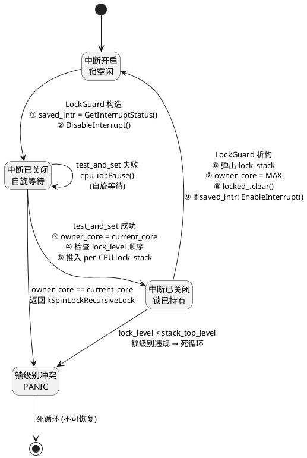
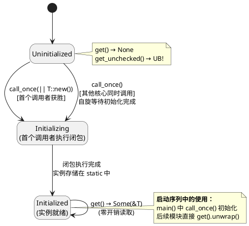

# 阶段 2：核心基础设施

> **依赖**：阶段 1 | **预计时间**：1 周 | **复杂度**：低-中

## 目标
同步原语、ELF 解析器、panic 处理程序、IO 缓冲区 —— 之后阶段所需的所有共享基础设施。

## 需要创建的文件
- `kernel/src/sync/spinlock.rs` — 带有中断保存/恢复功能的自定义 SpinLock
- `kernel/src/sync/mod.rs`
- `kernel/src/elf.rs` — ELF 符号表解析器
- `kernel/src/panic.rs` — 带有回溯功能和观察者模式的 Panic 处理程序

## 需要复用的文件
无

## C++ 参考文件
- `src/include/spinlock.hpp` → `kernel/src/sync/spinlock.rs`
- `src/include/kernel_elf.hpp` → `kernel/src/elf.rs`
- `src/include/panic_observer.hpp` → `kernel/src/panic.rs`

> **注意**：`io_buffer.rs` (RAII 对齐 I/O 缓冲区) 需要堆分配，而堆在阶段 3 才初始化。因此 IoBuffer 移至阶段 6（设备驱动，其 DMA 缓冲区是主要使用场景）。

## SpinLock + LockGuard 生命周期

SpinLock 是内核最基础的同步原语。LockGuard 封装了"关中断 → 获取锁 → 临界区 → 释放锁 → 恢复中断"的完整流程。



**锁级别层次（数值越小越先获取）：**

| 级别 | 名称 | 值 | 用途 |
|------|------|----|------|
| 0 | `kSchedLock` | 0 | 调度器锁（最先获取） |
| 1 | `kTaskTableLock` | 1 | 任务表锁 |
| 2 | `kInterruptThreadsLock` | 2 | 中断线程锁（最后获取） |
| — | `kUnclassified` | 0xFF | 未分类（不参与顺序检查） |

**规则**：持有高级别锁时不能获取低级别锁。违反则死循环 + 打印调用栈。

## 单例初始化状态机 (`spin::Once<T>`)

全局单例（TaskManager、DeviceManager 等）使用 `spin::Once<T>` 管理生命周期：



**项目单例清单（初始化顺序）：**

| 单例 | 初始化位置 | 依赖 |
|------|-----------|------|
| `PER_CPU_ARRAY` | `main()` 最先 | 无 |
| `MEMORY_MANAGER` | `MemoryInit()` | PER_CPU_ARRAY |
| `INTERRUPT_MANAGER` | `InterruptInit()` | MEMORY_MANAGER |
| `TASK_MANAGER` | `TaskManager::create()` | INTERRUPT_MANAGER |
| `DEVICE_MANAGER` | `DeviceInit()` | TASK_MANAGER |
| `VFS_MANAGER` | `FileSystemInit()` | DEVICE_MANAGER |

## 实现步骤
- [ ] 步骤 1：实现 `SpinLock`，在加锁/解锁时禁用/启用中断
- [ ] 步骤 2：为 SpinLock 编写单元测试（加锁、解锁、guard 释放）
- [ ] 步骤 3：实现 ELF 解析器（解析符号表、字符串表）
- [ ] 步骤 4：为 ELF 解析器编写单元测试（使用测试二进制数据）
- [ ] 步骤 5：实现带有 DumpStack 支持的 panic 处理程序
- [ ] 步骤 6：**TCB/调度器所有权原型（强制准入门槛）**

    在阶段 5 开始之前，验证 TCB 所有权模型。创建一个最小原型：
    ```rust
    // 证明 TaskControlBlock 可以：
    // 1. 存储在全局任务表中 (BTreeMap<Pid, Box<TaskControlBlock>>)
    // 2. 被调度器运行队列引用 (原始指针或 Pin<&mut TCB>)
    // 3. 被 Per-CPU "current_task" 指针引用
    // 4. 在 SpinLock 保护下安全访问
    //
    // 原型必须演示：
    // - 将 TCB 入队/出队到模拟调度器
    // - 在两个 TCB 之间切换 "current_task" 指针
    // - 通过任务表和调度器访问 TCB 字段
    //
    // 决策：记录是否使用：
    // (a) UnsafeCell + 原始指针，配合 SpinLock 保护的访问（可能性大）
    // (b) Arc<SpinLock<TCB>> (对调度器热路径来说开销太大)
    // (c) 侵入式链表 (最像 C，但最不符合 Rust 习惯)
    //
    // 该原型必须在阶段 5 推进前通过。
    ```

- [ ] 步骤 7：提交

## QEMU 预期输出
```
[0][0 0 INFO ] Hello SimpleKernel
[1][0 0 INFO ] Testing SpinLock... OK
[2][0 0 INFO ] Testing ELF parser... found 42 symbols
[3][0 0 INFO ] Testing panic handler...
PANIC at kernel/src/main.rs:XX: test panic
  backtrace:
    #0: 0x80200XXX - main::test_panic
    #1: 0x80200XXX - _start
[4][0 0 INFO ] TCB ownership prototype... OK
[5][0 0 INFO ] Phase 2 complete
```

## 验证命令
```bash
# 单元测试（宿主机）
cargo test --lib
# QEMU 运行
cargo xtask run --arch riscv64
```

## 测试策略说明

SpinLock 涉及中断行为，需要区分两种测试环境：

| 测试内容 | 环境 | 命令 | 可验证的行为 |
|----------|------|------|-------------|
| 锁/解锁逻辑、Guard RAII、try_lock | x86_64 宿主机 | `cargo test` | 互斥语义、Guard drop 正确释放 |
| 中断禁用/恢复、嵌套锁、跨核行为 | QEMU (riscv64/aarch64) | `cargo xtask run` | 加锁时中断已禁用、解锁后中断已恢复 |

宿主机单元测试**无法验证中断行为**（x86_64 用户态没有中断概念）。中断相关的 SpinLock 行为必须通过 QEMU 系统测试验证。

## 退出标准
1. `cargo test --lib` 全部通过 — SpinLock 互斥逻辑、ELF parser 测试（宿主机 x86_64）
2. QEMU 系统测试：SpinLock 正确禁用/恢复中断（观察日志确认）
3. QEMU 中 panic 显示调用栈（函数名从 ELF 符号表解析）
4. **TCB 所有权原型编译通过并测试通过 — 所有权模型决策已记录**

## 你可以修改的内容
- `spinlock.rs` — 锁策略、中断保存方式、锁级别层次
- `elf.rs` — ELF 解析实现
- `panic.rs` — panic 格式、调用栈输出格式
- TCB 所有权模型 — 可以选择不同的设计方案

---
> 返回 [总览](./00-概述.md) | 下一阶段：[P3 — 内存管理](./P3-内存管理.md)
