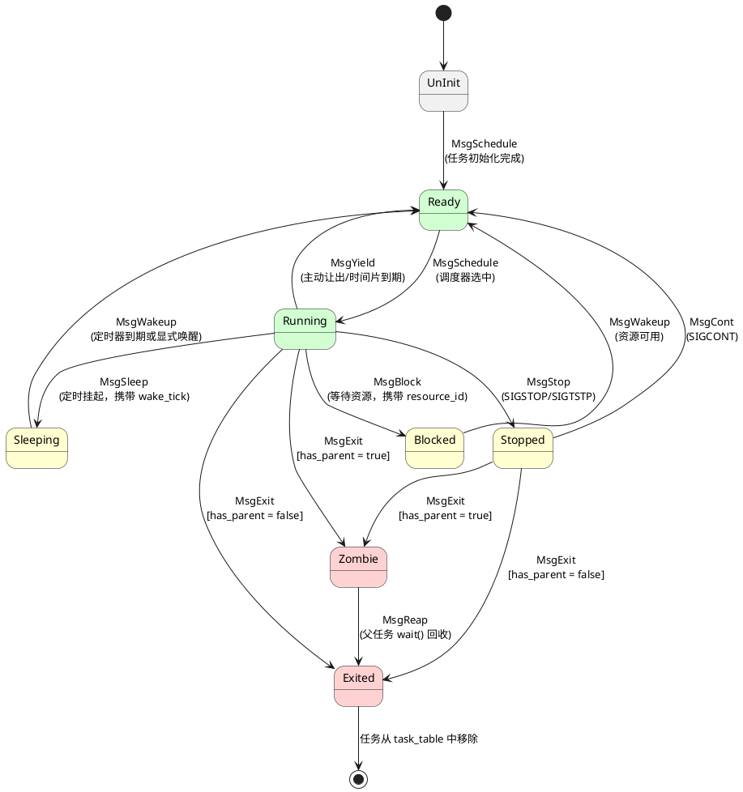
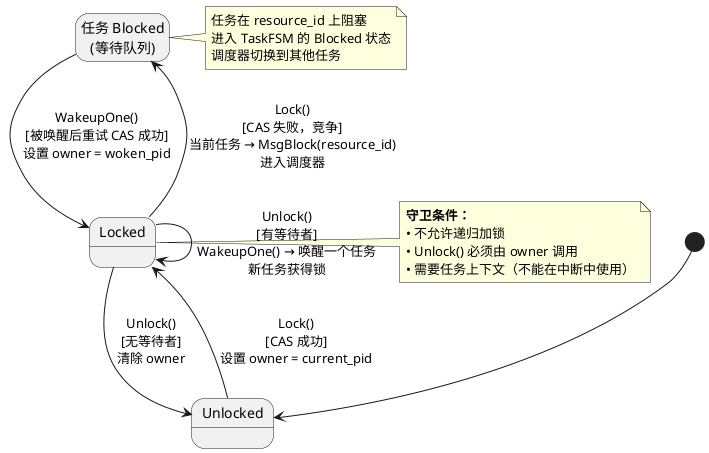

# 阶段 5：任务管理与调度

> **依赖**：阶段 4 | **预计时间**：3 周 | **复杂度**：极高（最高复杂度）

## 目标
完整任务子系统 — TCB、调度器（CFS/FIFO/RR）、clone/exit/wait/sleep/signal、SMP 负载均衡。

## 需要创建的文件
- `src/task/mod.rs`
- `src/task/tcb.rs` — TaskControlBlock
- `src/task/fsm.rs` — 任务状态机
- `src/task/manager.rs` — TaskManager（全局单例）
- `src/task/scheduler/mod.rs` — `Scheduler` trait
- `src/task/scheduler/cfs.rs`
- `src/task/scheduler/fifo.rs`
- `src/task/scheduler/round_robin.rs`
- `src/task/clone.rs`
- `src/task/exit.rs`
- `src/task/wait.rs`
- `src/task/sleep.rs`
- `src/task/block.rs`
- `src/task/wakeup.rs`
- `src/task/balance.rs`
- `src/task/signal.rs`
- `src/task/mutex.rs`（阻塞互斥锁）
- `src/task/messages.rs` — 任务 FSM 消息（9 种：Schedule, Yield, Sleep, Block, Wakeup, Exit, Reap, Stop, Cont）+ 生命周期消息（ThreadCreate, ThreadExit）
- `src/task/resource_id.rs` — ResourceType 枚举（10 种）+ ResourceId（8 位类型 + 56 位数据）
- `src/sync/mutex.rs`（更新）

## C++ 参考文件
- `src/task/include/*.hpp`（全部 10 个头文件）
- `src/task/*.cpp`（全部 12 个实现文件）
- `src/include/mutex.hpp` → `src/task/mutex.rs`
- `src/include/signal.hpp` → `src/task/signal.rs`
- `src/task/include/task_messages.hpp` → `src/task/messages.rs`
- `src/task/include/lifecycle_messages.hpp` → `src/task/messages.rs`
- `src/task/include/resource_id.hpp` → `src/task/resource_id.rs`

## 任务状态机 (Task FSM)

任务生命周期由 8 个状态和消息驱动的转换定义。Rust 实现使用 `enum TaskState` + `match` 替代 C++ 的 `etl::fsm`。



**转换表（完整）：**

| 当前状态 | 消息 | 条件 | 目标状态 | 触发场景 |
|----------|------|------|----------|----------|
| UnInit | MsgSchedule | — | Ready | `TaskManager::AddTask()` |
| Ready | MsgSchedule | — | Running | `Schedule()` 选中任务 |
| Running | MsgYield | — | Ready | 主动让出 / `OnTimeSliceExpired` |
| Running | MsgSleep | — | Sleeping | `sys_sleep(ms)` |
| Running | MsgBlock | — | Blocked | `Mutex::Lock()` 竞争 / I/O 等待 |
| Running | MsgExit | has_parent | Zombie | `sys_exit()` 有父任务 |
| Running | MsgExit | !has_parent | Exited | `sys_exit()` 无父任务 |
| Running | MsgStop | — | Stopped | `SIGSTOP` / `SIGTSTP` |
| Sleeping | MsgWakeup | — | Ready | 定时器到期 / `sys_wakeup()` |
| Blocked | MsgWakeup | — | Ready | 资源释放 / `WakeupOne()` |
| Stopped | MsgCont | — | Ready | `SIGCONT` |
| Stopped | MsgExit | has_parent | Zombie | 被 `SIGKILL` 终止 |
| Stopped | MsgExit | !has_parent | Exited | 被 `SIGKILL` 终止 |
| Zombie | MsgReap | — | Exited | 父任务调用 `sys_wait()` |

**线程安全**：FSM 状态变更通过 `atomic` 缓存（`Ordering::Release` 写入 / `Ordering::Acquire` 读取），读取不需要持锁。

## 阻塞 Mutex 状态机

阻塞 Mutex 与任务调度紧密耦合——竞争时当前任务进入 Blocked 状态。



## 实现步骤
- [ ] 步骤 1：定义 `Scheduler` trait（从 `SchedulerBase` 移植）

```rust
/// 完整的调度器 trait — 必须包含 C++ SchedulerBase 的所有钩子。
pub trait Scheduler: Send + Sync {
    /// 将任务添加到就绪队列。
    fn enqueue(&mut self, task: &mut TaskControlBlock);
    /// 从就绪队列中移除任务（用于阻塞/退出）。
    fn dequeue(&mut self, task: &mut TaskControlBlock);
    /// 选择下一个运行的任务（不从队列中移除）。
    fn pick_next(&mut self) -> Option<&mut TaskControlBlock>;
    /// 就绪队列中的任务数量。
    fn queue_size(&self) -> usize;
    /// 队列是否为空。
    fn is_empty(&self) -> bool;
    /// Tick 更新 — 如果需要抢占则返回 true。
    fn on_tick(&mut self, current: &mut TaskControlBlock) -> bool { false }
    /// 时间片到期 — 如果任务应重新入队则返回 true。
    fn on_time_slice_expired(&mut self, task: &mut TaskControlBlock) -> bool { true }
    /// 优先级继承：当高优先级任务等待该任务时提升其优先级。
    fn boost_priority(&mut self, _task: &mut TaskControlBlock, _new_priority: i32) {}
    /// 释放资源后恢复原始优先级。
    fn restore_priority(&mut self, _task: &mut TaskControlBlock) {}
    /// 当任务被抢占时调用（Running → Ready）。
    fn on_preempted(&mut self, _task: &mut TaskControlBlock) {}
    /// 当任务开始运行时调用（Ready → Running）。
    fn on_scheduled(&mut self, _task: &mut TaskControlBlock) {}
    /// 获取调度器统计信息。
    fn stats(&self) -> &SchedulerStats;
    /// 重置统计信息。
    fn reset_stats(&mut self);
}

/// 调度器统计信息（匹配 C++ SchedulerBase::Stats）
pub struct SchedulerStats {
    pub total_enqueues: usize,
    pub total_dequeues: usize,
    pub total_picks: usize,
    pub total_preemptions: usize,
}
```

- [ ] 步骤 2：实现 ResourceId 和 ResourceType（从 `resource_id.hpp` 移植）
- [ ] 步骤 3：将任务消息实现为 Rust 枚举（从 `task_messages.hpp` + `lifecycle_messages.hpp` 移植）
- [ ] 步骤 4：实现 TaskControlBlock（从 `task_control_block.hpp` 移植）
- [ ] 步骤 5：实现任务 FSM（具有有效转换的状态机）
- [ ] 步骤 6：实现 FIFO 调度器 + 单元测试
- [ ] 步骤 7：实现 Round-Robin 调度器 + 单元测试
- [ ] 步骤 8：实现 CFS 调度器 + 单元测试
- [ ] 步骤 9：实现 TaskManager 核心逻辑（AddTask, Schedule, GetCurrentTask）
- [ ] 步骤 10：实现 clone（任务创建）
- [ ] 步骤 11：实现 exit（任务终止 + 僵尸进程清理）
- [ ] 步骤 12：实现 wait（等待子进程）
- [ ] 步骤 13：实现 sleep（定时挂起）
- [ ] 步骤 14：实现 block/wakeup（基于资源的阻塞）
- [ ] 步骤 15：实现信号子系统
- [ ] 步骤 16：实现阻塞 Mutex
- [ ] 步骤 17：实现负载均衡（跨核工作窃取）
- [ ] 步骤 18：将 TaskManager 接入启动序列（InitCurrentCore, Schedule）
- [ ] 步骤 19：在 QEMU 中测试 — 验证任务切换、idle 任务、定时器抢占

## QEMU 预期输出
```
[0][0 0 INFO ] Hello SimpleKernel
...
[N][0 0 INFO ] TaskManager: init process (pid 1) created
[N][0 0 INFO ] TaskManager: idle thread (pid 0) created
[N][0 0 INFO ] Task [pid=2] "test_thread" started
[N][0 0 INFO ] Task [pid=2] sleeping 100ms...
[N][0 0 INFO ] Task [pid=3] "worker" running, count=1
[N][0 0 INFO ] Task [pid=2] woke up
[N][0 0 INFO ] Task [pid=3] exiting with code 0
[N][0 0 INFO ] Task [pid=1] reaped zombie pid=3
[N][1 0 INFO ] SMP: core 1 online, idle thread running
[N][1 0 INFO ] Balance: stole task pid=4 from core 0
```

## 验证命令
```bash
cargo test --lib  # CFS/FIFO/RR 调度器单元测试
cargo xtask run --arch riscv64  # 观察任务创建、切换、退出
```

## 退出标准
1. CFS/FIFO/RR 调度器单元测试通过
2. QEMU 中多个内核线程运行并切换
3. idle 线程让出 CPU 给就绪任务
4. Sleep/Wakeup/Block 正常工作
5. Clone 创建子任务，Exit 变成 zombie，Wait 回收
6. Signal 传递工作（SIGKILL 终止任务）
7. SMP: 跨核负载均衡（2 核配置下可观察）
8. 阻塞 Mutex: 竞争时任务正确阻塞和唤醒

## 你可以修改的内容
- `scheduler/*.rs` — 调度算法实现
- `tcb.rs` — 任务控制块字段、状态机
- `clone.rs/exit.rs/wait.rs` — 任务生命周期逻辑
- `signal.rs` — 信号处理策略
- `balance.rs` — 负载均衡策略（窃取阈值等）
- `mutex.rs` — 阻塞互斥锁实现

---
> 返回 [总览](./00-概述.md) | 上一阶段：[P4](./P4-中断与定时器.md) | 下一阶段：[P6](./P6-设备框架与驱动.md)
